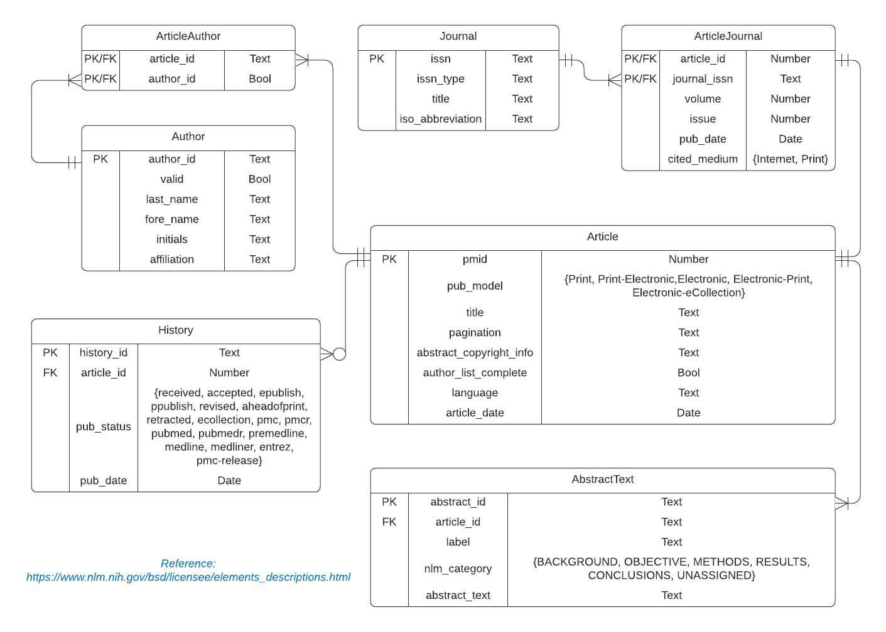

### Authors:
- Simin Zhang
- Yiman Liu
- Zhi Wen

## Part 1 (40 pts) Load XML

1. (5 pts) Create a normalized relational schema that contains minimally the following entities: Article, Journal, Author, History. Use the XML document to determine the appropriate attributes (fields/columns) for the entities (tables). While there may be other types of publications in the XML, you only need to deal with articles in journals. Create appropriate primary and foreign keys. Where necessary, add surrogate keys. Include an image of an ERD showing your model in your R Notebook.

#### Schema
Article(<u>pmid</u>, pub_model, title, pagination, abstract_copyright_info, author_list_complete, language, article_date)   
Journal(<u>issn</u>, issn_type, title, iso_abbreviation)   
Author(<u>author_id</u>, valid, last_name, fore_name, initials, affiliation)   
History(<u>history_id</u>, *article_id*, pub_status, pub_date)   
AbstractText(<u>abstract_id</u>, *article_id*, label, nlm_category, abstract_text)   
ArticleJournal(<u>*article_id*</u>, <u>*journal_issn*</u>, volume, issue, pub_date, cited_medium)   
ArticleAuthor(<u>*article_id*</u>, <u>*author_id*</u>)   

#### ERD


2. (5 pts) Realize the relational schema in SQLite (place the CREATE TABLE statements into SQL chunks in your R Notebook).

```{r setup connection}
library(DBI)
con <- dbConnect(RSQLite::SQLite(), "pubmed_normalized.sqlite")
```


```{sql create Article, connection=con}
CREATE TABLE If NOT EXISTS Article (
  pmid                      NUMERIC NOT NULL PRIMARY KEY,
  pub_model                 TEXT    CHECK(pub_model IN ('Print', 'Print-Electronic', 'Electronic', 'Electronic-Print', 'Electronic-eCollection')),
  title                     TEXT    NOT NULL,
  pagination                TEXT,
  abstract_copyright_info   TEXT,
  author_list_complete      BOOLEAN NOT NULL,
  language                  TEXT    NOT NULL,
  article_date              DATE
);
```

```{sql create Journal, connection=con}
CREATE TABLE If NOT EXISTS Journal (
  issn              TEXT NOT NULL PRIMARY KEY,
  issn_type         TEXT NOT NULL,
  title             TEXT NOT NULL,
  iso_abbreviation  TEXT NOT NULL
);

```

```{sql create Author, connection=con}
CREATE TABLE If NOT EXISTS Author (
  author_id     TEXT    NOT NULL PRIMARY KEY,
  valid         BOOLEAN NOT NULL,
  last_name     TEXT    NOT NULL,
  fore_name     TEXT    NOT NULL,
  initials      TEXT,
  affiliation   TEXT
);
```

```{sql create History, connection=con}
CREATE TABLE If NOT EXISTS History (
  history_id    TEXT    NOT NULL PRIMARY KEY,
  article_id    NUMERIC NOT NULL,
  pub_status    TEXT    CHECK(pub_status IN ('received', 'accepted', 'epublish', 'ppublish', 'revised', 'aheadofprint',
  'retracted', 'ecollection', 'pmc', 'pmcr', 'pubmed', 'pubmedr', 'premedline', 'medline', 'medliner', 'entrez', 'pmc-release')),
  pub_date      DATE    NOT NULL,
  FOREIGN KEY(article_id) REFERENCES Article(pmid)
);
```

```{sql create AbstractText, connection=con}
CREATE TABLE If NOT EXISTS AbstractText (
  abstract_id    TEXT     NOT NULL PRIMARY KEY,
  article_id      NUMERIC NOT NULL,
  label           TEXT,
  nlm_category    TEXT    CHECK(nlm_category IN ('BACKGROUND', 'OBJECTIVE', 'METHODS', 'RESULTS', 'CONCLUSIONS', 'UNASSIGNED')),
  abstract_text   TEXT    NOT NULL,
  FOREIGN KEY(article_id) REFERENCES Article(pmid)
);
```

```{sql create ArticleJournal, connection=con}
CREATE TABLE If NOT EXISTS ArticleJournal (
  article_id        NUMERIC NOT NULL,
  journal_issn      TEXT    NOT NULL,
  volume            TEXT    NOT NULL,
  issue             TEXT    NOT NULL,
  pub_date          DATE    NOT NULL,
  cited_medium      TEXT    CHECK(cited_medium IN ('Internet', 'Print')),
  PRIMARY KEY (article_id, journal_issn),
  FOREIGN KEY(article_id)   REFERENCES Article(pmid),
  FOREIGN KEY(journal_issn) REFERENCES Journal(issn)
);
```

```{sql create ArticleAuthor, connection=con}
CREATE TABLE If NOT EXISTS ArticleAuthor (
  article_id    NUMERIC NOT NULL,
  author_id     TEXT    NOT NULL,
  PRIMARY KEY (article_id, author_id),
  FOREIGN KEY(article_id) REFERENCES Article(pmid),
  FOREIGN KEY(author_id)  REFERENCES Author(author_id)
);
```

```{sql enable foreign key constraint, connection=con}
PRAGMA foreign_keys = 1
```

```{r check tables}
print(dbListTables(con))
```

3. (30 pts) Extract and transform the data from the XML and then load into the appropriate tables in the database. You cannot use xmlToDataFrame but instead must parse the XML node by node using a combination of node-by-node tree traversal and XPath. It is not feasible to use XPath to extract all journals, then all authors, etc. as some are missing and won't match up. You will need to iterate through the top-level nodes.

```{r load library}
library(XML)
```

``` {r date node funtion}
parseDateNode <- function(node){
  res <- NA
  for (i in 1:xmlSize(node))
  {
    if (i == 1)
    {
      res <- xmlValue(node[[i]])
    }
    else if (i > 1 && i < 4) {
      res <- paste0(res, '-', xmlValue(node[[i]]))
    }
    else if (i == 4) {
      res <- paste0(res, ' ', xmlValue(node[[i]]))
    }
    else {
      res <- paste0(res, ':', xmlValue(node[[i]]))
    }
  }
  return(res)
}
```

``` {r parse data from xml}
xml <- xmlParse('pubmed_sample.xml')
root <- xmlRoot(xml)

art_pmids <- c()
art_pub_models <- c()
art_titles <- c()
art_paginations <- c()
art_languages <- c()
art_dates <- c()
art_copyrights <- c()
art_author_list_complete <- c()

art_issns <- c()
art_volumes <- c()
art_issues <- c()
art_pub_dates <- c()
art_cited_medium <- c()

abs_ids <- c()
abs_articles <- c()
abs_labels <- c()
abs_nlm_categories <- c()
abs_texts <- c()

hst_ids <- c()
hst_articles <- c()
hst_pub_status <- c()
hst_pub_dates <- c()

jnl_issn <- c()
jnl_issn_type <- c()
jnl_titles <- c()
jnl_iso_abbr <- c()

au_ids <- c()
au_valids <- c()
au_last_names <- c()
au_fore_names <- c()
au_initials <- c()
au_affilications <- c()
au_fullname_to_id <- c()

au_art_auids <- c()
au_art_artids <- c()

for (idx in 1:xmlSize(root))
{
  art_dates[idx] <- NA
  art_copyrights[idx] <- NA
  for (i in 1:xmlSize(root[[idx]]))
  {
    node <- root[[idx]][[i]]
    if (xmlName(node) == 'MedlineCitation')
    {
      for (j in 1:xmlSize(node))
      {
        if (xmlName(node[[j]]) == 'PMID')
        {
          art_pmids[idx] <- as.integer(xmlValue(node[[j]]))
        }
        else if (xmlName(node[[j]]) == 'Article') {
          article <- node[[j]]
          art_pub_models[idx] <- xmlAttrs(article)[1]
          for (k in 1:xmlSize(article))
          {
            if (xmlName(article[[k]]) == 'Journal')
            {
              journal <- article[[k]]
              issn <- xmlValue(journal[[1]])
              art_issns[idx] <- issn
              art_cited_medium[idx] <- xmlAttrs(journal[[2]])[1]
              art_volumes[idx] <- xmlValue(journal[[2]][[1]])
              art_issues[idx] <- xmlValue(journal[[2]][[2]])
              art_pub_dates[idx] <- parseDateNode(journal[[2]][[3]])
              if (!is.element(issn, jnl_issn))
              {
                id <- length(jnl_issn) + 1
                jnl_issn[id] <- issn
                jnl_issn_type[id] <- xmlAttrs(journal[[1]])[1]
                jnl_titles[id] <- xmlValue(journal[[3]])
                jnl_iso_abbr[id] <-xmlValue(journal[[4]])
              }
            }
            else if (xmlName(article[[k]]) == 'ArticleTitle') {
              art_titles[idx] <- xmlValue(article[[k]])
            }
            else if (xmlName(article[[k]]) == 'Pagination') {
              art_paginations[idx] <- xmlValue(article[[k]][[1]])
            }
            else if (xmlName(article[[k]]) == 'Language') {
              art_languages[idx] <- xmlValue(article[[k]])
            }
            else if (xmlName(article[[k]]) == 'ArticleDate') {
              art_dates[idx] <- parseDateNode(article[[k]])
            }
            else if (xmlName(article[[k]]) == 'AuthorList') {
              authorlist <- article[[k]]
              if (xmlAttrs(authorlist)[1] == 'Y')
              {
                art_author_list_complete[idx] <- TRUE
              }
              else {
                art_author_list_complete[idx] <- FALSE
              }
              for (m in 1:xmlSize(authorlist))
              {
                author <- authorlist[[m]]
                last_name <- NA
                fore_name <- NA
                initials <- NA
                affilication <- NA
                for (n in 1:xmlSize(author))
                {
                  if (xmlName(author[[n]]) == 'LastName')
                  {
                    last_name <- xmlValue(author[[n]])
                  }
                  else if (xmlName(author[[n]]) == 'ForeName') {
                    fore_name <- xmlValue(author[[n]])
                  }
                  else if (xmlName(author[[n]]) == 'Initials') {
                    initials <- xmlValue(author[[n]])
                  }
                  else if (xmlName(author[[n]]) == 'Affiliation') {
                    affilication <- xmlValue(author[[n]])
                  }
                }
                fullname <- paste0(last_name, '#', fore_name)
                auid <- NA
                if (fullname %in% names(au_fullname_to_id))
                {
                  auid <- au_fullname_to_id[fullname]
                }
                else {
                  id <- length(au_ids) + 1
                  auid <- paste0('au_', id)
                  au_fullname_to_id[fullname] <- auid
                  au_ids[id] <- auid
                  if (xmlAttrs(author)[1] =='Y')
                  {
                    au_valids[id] <- TRUE
                  }
                  else {
                    au_valids[id] <- FALSE
                  }
                  au_last_names[id] <- last_name
                  au_fore_names[id] <- fore_name
                  au_initials[id] <- initials
                  au_affilications[id] <- affilication
                  
                  
                }
                id <- length(au_art_artids) + 1
                au_art_auids[id] <- auid
                au_art_artids[id] <- art_pmids[idx]
              }
            }
            else if (xmlName(article[[k]]) == 'Abstract') {
              abstract <- article[[k]]
              abstract_texts <- c()
              for (m in 1:xmlSize(abstract))
              {
                if (xmlName(abstract[[m]]) == 'AbstractText')
                {
                  id <- length(abs_ids) + 1
                  abs_ids[id] <- paste0('abs_', id)
                  abs_articles[id] <- art_pmids[idx]
                  abs_texts[id] <- c(abstract_texts, xmlValue(abstract[[m]]))
                  attrs <- xmlAttrs(abstract[[m]])
                  if (length(attrs) > 0)
                  {
                    abs_labels[id] <- attrs[1]
                    abs_nlm_categories[id] <- attrs[2]
                  }
                  else {
                    abs_labels[id] <- NA
                    abs_nlm_categories[id] <- NA
                  }
                }
                else if (xmlName(abstract[[m]]) == 'CopyrightInformation') {
                  art_copyrights[idx] <- xmlValue(abstract[[m]])
                }
              }
            }
          }
        }
      }
    }
    else if (xmlName(node) == 'PubmedData') {
      for (j in 1:xmlSize(node))
      {
        if (xmlName(node[[j]]) == 'History')
        {
          history <- node[[j]]
          for (k in 1:xmlSize(history))
          {
            id <- length(hst_ids) + 1
            hst_ids[id] <- paste0('hst_', id)
            hst_articles[id] <- art_pmids[idx]
            hst_pub_status[id] <- xmlAttrs(history[[k]])[1]
            hst_pub_dates[id] <- parseDateNode(history[[k]])
          }
        }
      }
    }
  }
}
```

``` {r convert data to df}
df_article <- data.frame(
  pmid = art_pmids,
  pub_model = art_pub_models,
  title = art_titles,
  pagination = art_paginations,
  abstract_copyright_info = art_copyrights,
  author_list_complete = art_author_list_complete,
  language = art_languages,
  article_date = art_dates
)
df_abstract <- data.frame(
  abstract_id = abs_ids,
  article_id = abs_articles,
  label = abs_labels,
  nlm_category = abs_nlm_categories,
  abstract_text = abs_texts
)
df_history <- data.frame(
  history_id = hst_ids,
  article_id = hst_articles,
  pub_status = hst_pub_status,
  pub_date = hst_pub_dates
)
df_journal <- data.frame(
  issn = jnl_issn,
  issn_type = jnl_issn_type,
  title = jnl_titles,
  iso_abbreviation = jnl_iso_abbr
)
df_article_journal <- data.frame(
  article_id = art_pmids,
  journal_issn = art_issns,
  volume = art_volumes,
  issue = art_issues,
  pub_date = art_pub_dates,
  cited_medium = art_cited_medium
)
df_author <- data.frame(
  author_id = au_ids,
  valid = au_valids,
  last_name = au_last_names,
  fore_name = au_fore_names,
  initials = au_initials,
  affiliation = au_affilications
)
df_article_author <- data.frame(
  article_id = au_art_artids,
  author_id = au_art_auids
)
```

```{r view data in dataframes}
print(df_article)
print(df_journal)
print(df_author)
print(df_history)
print(df_abstract)
print(df_article_journal)
print(df_article_author)
```

```{r insert data to tables, include=FALSE}
dbAppendTable(con, 'Article', df_article)
dbAppendTable(con, 'Journal', df_journal)
dbAppendTable(con, 'Author', df_author)
dbAppendTable(con, 'History', df_history)
dbAppendTable(con, 'AbstractText', df_abstract)
dbAppendTable(con, 'ArticleJournal', df_article_journal)
dbAppendTable(con, 'ArticleAuthor', df_article_author)
```


```{sql check Article data, connection=con}
SELECT * FROM Article
```

```{sql check Journal data, connection=con}
SELECT * FROM Journal
```

```{sql check Author data, connection=con}
SELECT * FROM Author
```

```{sql check History data, connection=con}
SELECT * FROM History
```

```{sql check AbstractText data, connection=con}
SELECT * FROM AbstractText
```

```{sql check ArticleJournal data, connection=con}
SELECT * FROM ArticleJournal
```

```{sql check ArticleAuthor data, connection=con}
SELECT * FROM ArticleAuthor
```


## Part 2 (40 pts) Create Star/Snowflake Schema
1. (20 pts) Create and populate a star schema with dimension and transaction fact tables. Each row in the fact table will represent one article. Include the image of an updated ERD that contains the fact table and any additional required dimension tables. Populate the star schema in R. When building the schema, look a head to Part 3 as the schema is dependent on the eventual OLAP queries.

#### Schema

ArticleFact(<u>pmid</u>, pub_model, title, pagination, abstract_copyright_info, author_list_complete, language, *article_date_id*, *journal_dim_id*)   

ArticleDateDim(<u>article_date_id</u>, year, month, day)

JournalDim(<u>journal_dim_id</u>, *journal_issn*, volume, issue, *pub_date_id*, cited_medium )
 
JournalPubDateDim(<u>pub_date_id</u>, year, month)

IssnDim(<u>issn</u>, issn_type, title, iso_abbreviation) 

AuthorListDim(<u>*pmid*</u>, <u>*article_id*</u>)  
  
AuthorDim(<u>author_id</u>, valid, last_name, fore_name, initials, affiliation)


#### ERD
https://lucid.app/lucidchart/invitations/accept/2612a2ae-a396-4453-869f-02e676457587

.png)


```{sql connection=con}

-- drop the tables if they already exist
DROP TABLE IF EXISTS ArticleFact;

```


```{sql connection=con}

-- drop the tables if they already exist
DROP TABLE IF EXISTS ArticleDateDim;

```


```{sql connection=con}

-- drop the tables if they already exist
DROP TABLE IF EXISTS JournalDim;

```

```{sql connection=con}

-- drop the tables if they already exist
DROP TABLE IF EXISTS IssnDim;

```

```{sql connection=con}

-- drop the tables if they already exist
DROP TABLE IF EXISTS JournalPubDateDim;

```

```{sql connection=con}

-- drop the tables if they already exist
DROP TABLE IF EXISTS AuthorListDim;

```

```{sql connection=con}

-- drop the tables if they already exist
DROP TABLE IF EXISTS AuthorDim;

```


```{sql connection=con}

-- create the dimension tables

CREATE TABLE ArticleDateDim(
  article_date_id INTEGER NOT NULL PRIMARY KEY AUTOINCREMENT,
  year TEXT,
  month TEXT,
  day TEXT
);


```


```{sql connection=con}

-- load the ArticleDateDim Table
INSERT INTO ArticleDateDim
  (year, month, day)
  SELECT substr(article_date,1,4) AS year,
    substr(article_date, 6,2) AS month,
    substr(article_date,9,2) AS day
    FROM Article;

```


```{sql connection=con}

SELECT * FROM ArticleDateDim;

```


```{sql connection=con}

-- create the dimension tables and load the dimension tables

CREATE TABLE IssnDim(
  issn TEXT NOT NULL PRIMARY KEY,
  issn_type TEXT NOT NULL,
  title TEXT NOT NULL,
  iso_abbreviation TEXT NOT NULL


);


```


```{sql connection=con}

-- load the dimension tables
    
INSERT INTO IssnDim
(issn, issn_type, title, iso_abbreviation)
  SELECT issn, issn_type, title, iso_abbreviation FROM Journal;


```


```{sql connection=con}


SELECT * FROM IssnDim; 

```


```{r}
# get the data from table to dataframe

issndim_result<-dbGetQuery(con,"SELECT issn FROM IssnDim")
print(issndim_result)

```


```{sql connection=con}


-- create the dimension tables
CREATE TABLE JournalPubDateDim(
  pub_date_id INTEGER NOT NULL PRIMARY KEY AUTOINCREMENT,
  year TEXT,
  month TEXT
);

```


```{sql connection=con}


-- load the dimension tables
INSERT INTO JournalPubDateDim
  (year, month)
    SELECT substr(pub_date,1,4) AS year,
    substr(pub_date,6,3) AS month
    FROM ArticleJournal;


```


```{sql connection=con}

SELECT * FROM JournalPubDateDim;

```

```{r}
# get the data from table to dataframe

journalpubdatedim_result<-dbGetQuery(con,"SELECT pub_date_id FROM JournalPubDateDim")

print(journalpubdatedim_result)
```


```{sql connection=con}


-- create the dimension tables
CREATE TABLE JournalDim(
  journal_dim_id INTEGER NOT NULL PRIMARY KEY AUTOINCREMENT,
  journal_issn TEXT NOT NULL,
  volume NUMERIC NOT NULL,
  issue NUMERIC NOT NULL,
  pub_date_id INTEGER NOT NULL,
  cited_medium TEXT CHECK(cited_medium IN ('Internet', 'Print')),
  FOREIGN KEY(journal_issn) REFERENCES IssnDim(issn),
  FOREIGN KEY(pub_date_id) REFERENCES JournalPubDateDim(pub_date_id)
);

```


```{r}
# get the data from table to dataframe

journal_issn_result<-dbGetQuery(con,"SELECT journal_issn FROM ArticleJournal")
```


```{r}

print(journal_issn_result)

```


```{r}

# load the dimension tables

journal_dim_df <- data.frame(
  journal_issn = journal_issn_result,
  volume = art_volumes,
  issue = art_issues,
  pub_date_id = journalpubdatedim_result,
  cited_medium = art_cited_medium
)
```


```{r}

print(journal_dim_df)

```


```{r insert data to JournalDim tables, include=FALSE}

dbAppendTable(con, "JournalDim", journal_dim_df)

```


```{sql connection=con}


SELECT * FROM JournalDim; 

```


```{sql connection=con}


-- create the fact table

CREATE TABLE ArticleFact(
  pmid NUMERIC NOT NULL PRIMARY KEY,
  pub_model TEXT CHECK(pub_model IN ('Print', 'Print-Electronic', 'Electronic', 'Electronic-Print', 'Electronic-eCollection')),
  title TEXT NOT NULL,
  pagination TEXT,
  abstract_copyright_info TEXT,
  author_list_complete BOOLEAN NOT NULL,
  language TEXT NOT NULL,
  article_date_id INTEGER NOT NULL,
  journal_dim_id INTEGER NOT NULL,
  FOREIGN KEY(article_date_id) REFERENCES ArticleDateDim(article_date_id),
  FOREIGN KEY(journal_dim_id) REFERENCES JournalDim(journal_dim_id)
  
);

```


```{r}
# get the data from table to dataframe

articledatedim_result<-dbGetQuery(con,"SELECT article_date_id FROM ArticleDateDim")

print(articledatedim_result)

```


```{r}
# get the data from table to dataframe

journal_dim_id_result<-dbGetQuery(con,"SELECT journal_dim_id FROM JournalDim")

print(journal_dim_id_result)
```


```{r}

# load the ArticleDateDim Table

article_fact_df <- data.frame(
  pmid = art_pmids,
  pub_model = art_pub_models,
  title = art_titles,
  pagination = art_paginations,
  abstract_copyright_info = art_copyrights,
  author_list_complete = art_author_list_complete,
  language = art_languages,
  article_date_id = articledatedim_result,
  journal_dim_id = journal_dim_id_result
)


print(article_fact_df)

```


```{r data to ArticleFact tables, include=FALSE}

dbAppendTable(con, "ArticleFact", article_fact_df)

```


```{sql connection=con}

SELECT * FROM ArticleFact;

```


```{sql connection=con}

-- create the dimension tables and load the dimension tables

CREATE TABLE AuthorListDim
  AS SELECT article_id, author_id FROM ArticleAuthor;

```


```{sql connection=con}

SELECT * from AuthorListDim;

```


```{sql connection=con}

-- create the dimension tables and load the dimension tables

CREATE TABLE AuthorDim
  AS SELECT author_id, valid, last_name, fore_name, initials, affiliation FROM
  Author;

```


```{sql connection=con}

SELECT * from AuthorDim;

```


2. (20 pts) In the same schema as the previous step, create and populate a summary fact table that represents number of articles per time period (quarter, year) by author and by journal. Include the image of an updated ERD that contains the fact table. Populate the fact table in R. When building the schema, look a head to Part 3 as the schema is dependent on the eventual OLAP queries.


#### Schema

ArticleFact(<u>pmid</u>, pub_model, title, pagination, abstract_copyright_info, author_list_complete, language, *article_date_id*, *journal_dim_id*, article_pub_quarter, article_pub_year)   

ArticleDateDim(<u>article_date_id</u>, year, month, day, quarter)

JournalDim(<u>journal_dim_id</u>, *journal_issn*, volume, issue, *pub_date_id*, cited_medium )
 
JournalPubDateDim(<u>pub_date_id</u>, year, month, quarter)

IssnDim(<u>issn</u>, issn_type, title, iso_abbreviation) 

AuthorListDim(<u>*pmid*</u>, <u>*article_id*</u>)  
  
AuthorDim(<u>author_id</u>, valid, last_name, fore_name, initials, affiliation)


#### ERD
https://lucid.app/lucidchart/invitations/accept/462fd7de-fc42-4d4d-992c-4c4e71c14b5b


.png)


```{sql connection=con}

-- drop the tables if they already exist
DROP TABLE IF EXISTS ArticleFact;

```


```{sql connection=con}

-- drop the tables if they already exist
DROP TABLE IF EXISTS ArticleDateDim;

```

```{sql connection=con}

-- drop the tables if they already exist
DROP TABLE IF EXISTS JournalDim;

```

```{sql connection=con}

-- drop the tables if they already exist
DROP TABLE IF EXISTS IssnDim;

```

```{sql connection=con}

-- drop the tables if they already exist
DROP TABLE IF EXISTS JournalPubDateDim;

```

```{sql connection=con}

-- drop the tables if they already exist
DROP TABLE IF EXISTS AuthorListDim;

```

```{sql connection=con}

-- drop the tables if they already exist
DROP TABLE IF EXISTS AuthorDim;

```


```{sql connection=con}

-- create the dimension tables and load the dimension tables

CREATE TABLE ArticleDateDim(
  article_date_id INTEGER NOT NULL PRIMARY KEY AUTOINCREMENT,
  year TEXT,
  month TEXT,
  day TEXT,
  quarter TEXT
);


```


```{sql connection=con}

-- load the ArticleDateDim Table
INSERT INTO ArticleDateDim
  (year, month, day, quarter)
  SELECT substr(article_date,1,4) AS year,
    substr(article_date, 6,2) AS month,
    substr(article_date,9,2) AS day,
      CASE
        WHEN strftime("%m", article_date) BETWEEN "01" AND "03" THEN "Q1"
        WHEN strftime("%m", article_date) BETWEEN "04" AND "06" THEN "Q2"
        WHEN strftime("%m", article_date) BETWEEN "07" AND "09" THEN "Q3"
        WHEN strftime("%m", article_date) BETWEEN "10" AND "12" THEN "Q4"
        ELSE NULL
        END as quarter
    
    FROM Article;

```


```{sql connection=con}

SELECT * FROM ArticleDateDim;

```


```{r}
# get the data from table to dataframe

articledatedim_article_date_id <-dbGetQuery(con,"SELECT article_date_id FROM ArticleDateDim")
articledatedim_quarter<-dbGetQuery(con,"SELECT quarter AS article_pub_quater  FROM ArticleDateDim")
articledatedim_year<-dbGetQuery(con,"SELECT year AS article_pub_year  FROM ArticleDateDim")

print(articledatedim_article_date_id)
print(articledatedim_quarter)
print(articledatedim_year)

```


```{sql connection=con}

-- create the dimension tables and load the dimension tables

CREATE TABLE IssnDim(
  issn TEXT NOT NULL PRIMARY KEY,
  issn_type TEXT NOT NULL,
  title TEXT NOT NULL,
  iso_abbreviation TEXT NOT NULL


);


```


```{sql connection=con}

-- load the dimension tables
    
INSERT INTO IssnDim
(issn, issn_type, title, iso_abbreviation)
  SELECT issn, issn_type, title, iso_abbreviation FROM Journal;


```


```{sql connection=con}


SELECT * FROM IssnDim; 

```


```{sql connection=con}


-- create the dimension tables
CREATE TABLE JournalPubDateDim(
  pub_date_id INTEGER NOT NULL PRIMARY KEY,
  year TEXT,
  month TEXT,
  quarter TEXT
  
);

```


```{sql connection=con}

-- load the dimension tables
INSERT INTO JournalPubDateDim
  (year, month, quarter)
    SELECT substr(pub_date,1,4) AS year,
    substr(pub_date,6,3) AS month,
    
    CASE
        WHEN substr(pub_date,6,3) IN ("Jan", "Feb", "Mar" ) THEN "Q1"
        WHEN substr(pub_date,6,3) IN ("Apr", "May", "Jun" ) THEN "Q2"
        WHEN substr(pub_date,6,3) IN ("Jul", "Aug", "Sep" ) THEN "Q3"
        WHEN substr(pub_date,6,3) IN ("Oct", "Nov", "Dec" ) THEN "Q4"
        ELSE NULL
    END AS quarter
    FROM ArticleJournal;
```


```{sql connection=con}

SELECT * FROM JournalPubDateDim;

```


```{r}
# get the data from table to dataframe

journalpubdatedim_pub_date_id_part_2 <-dbGetQuery(con,"SELECT pub_date_id FROM JournalPubDateDim")
print(journalpubdatedim_pub_date_id_part_2)


```


```{sql connection=con}


-- create the dimension tables
CREATE TABLE JournalDim(
  journal_dim_id INTEGER NOT NULL PRIMARY KEY AUTOINCREMENT,
  journal_issn TEXT NOT NULL,
  volume NUMERIC NOT NULL,
  issue NUMERIC NOT NULL,
  pub_date_id INTEGER NOT NULL,
  cited_medium TEXT CHECK(cited_medium IN ('Internet', 'Print')),
  FOREIGN KEY(journal_issn) REFERENCES IssnDim(issn),
  FOREIGN KEY(pub_date_id) REFERENCES JournalPubDateDim(pub_date_id)
);

```


```{r}
# get the data from table to dataframe

journal_issn_result_part_2<-dbGetQuery(con,"SELECT journal_issn FROM ArticleJournal")

print(journal_issn_result_part_2)
```

```{r}

# load the dimension tables

journaldim_df_part_2 <- data.frame(
  journal_issn = journal_issn_result_part_2,
  volume = art_volumes,
  issue = art_issues,
  pub_date_id = journalpubdatedim_pub_date_id_part_2,
  cited_medium = art_cited_medium
)
```


```{r insert data to JournalDim tables, include=FALSE}
dbAppendTable(con, 'JournalDim', journaldim_df_part_2)

```


```{sql connection=con}
SELECT * FROM JournalDim;
```


```{sql connection=con}


-- create the fact table

CREATE TABLE ArticleFact(
  pmid NUMERIC NOT NULL PRIMARY KEY,
  pub_model TEXT CHECK(pub_model IN ('Print', 'Print-Electronic', 'Electronic', 'Electronic-Print', 'Electronic-eCollection')),
  title TEXT NOT NULL,
  pagination TEXT,
  abstract_copyright_info TEXT,
  author_list_complete BOOLEAN NOT NULL,
  language TEXT NOT NULL,
  article_date_id NUMERIC NOT NULL,
  journal_dim_id INTEGER NOT NULL,
  article_pub_quater TEXT,
  article_pub_year TEXT,
  FOREIGN KEY(article_date_id) REFERENCES ArticleDateDim(article_date_id),
  FOREIGN KEY(journal_dim_id) REFERENCES JournalDim(journal_dim_id)
  
);

```

```{r}
# get the data from table to dataframe

journal_dim_id_result_part_2<-dbGetQuery(con,"SELECT journal_dim_id FROM JournalDim")

print(journal_dim_id_result_part_2)
```


```{r}

# load the ArticleDateDim Table

df_article_fact_part_2 <- data.frame(
  pmid = art_pmids,
  pub_model = art_pub_models,
  title = art_titles,
  pagination = art_paginations,
  abstract_copyright_info = art_copyrights,
  author_list_complete = art_author_list_complete,
  language = art_languages,
  article_date_id = articledatedim_article_date_id,
  journal_dim_id = journal_dim_id_result_part_2,
  article_pub_quater = articledatedim_quarter,
  article_pub_year = articledatedim_year
)


```


```{r}

print(df_article_fact_part_2)

```


```{r insert data to ArticleFact tables, include=FALSE}
dbAppendTable(con, 'ArticleFact', df_article_fact_part_2)

```


```{sql connection=con}

SELECT * FROM ArticleFact;
```


```{sql connection=con}

-- create the dimension tables and load the dimension tables

CREATE TABLE AuthorListDim
  AS SELECT article_id, author_id FROM ArticleAuthor;

```


```{sql connection=con}
SELECT * FROM AuthorListDim;
```


```{sql connection=con}

-- create the dimension tables and load the dimension tables

CREATE TABLE AuthorDim
  AS SELECT author_id, valid, last_name, fore_name, initials, affiliation FROM
  Author;

```


```{sql connection=con}

SELECT * from AuthorDim;

```


## Part 3 (20 pts) Explore and Mine Data  
* 1. (10 pts) Write queries using your data warehouse to explore whether the publications show a seasonal pattern. Look beyond the pattern of number of publications per season. Adjust your fact tables as needed to support your new queries. If you need to update the fact table, document your changes and your reasons why the changes are needed.

```{sql, connection=con}
-- Get number of publications per season in 2011
SELECT article_pub_year, article_pub_quater, COUNT(*)
FROM ArticleFact
WHERE article_pub_year = '2011'
GROUP BY article_pub_quater;
```

```{sql, connection=con}
-- Get number of publications per season in 2012
SELECT article_pub_year, article_pub_quater, COUNT(*)
FROM ArticleFact
WHERE article_pub_year = '2012'
GROUP BY article_pub_quater;
```

#### Data analysis:   
**from the data of the two years, the number of publications may be influenced by a seasonal factor, in this case, it could the quarter of the year. As we can see there are the same number of publications in both 2011 and 2021 Q4. But I think the data set it too small to reflect a seasonal pattern. Thus, I also tried to explore other data to see what else I can find.**

**For example, I tried to explore how the season articles were published relate to the number of authors, but with above data warehouse, or say fact tables, I have to write queries including multiple JOIN statements to get the results as showing below: **

```{sql, connection=con}
-- This is not efficient for OLAP queries. 
SELECT count(Author.author_id)
from Author
    INNER JOIN ArticleAuthor ON Author.author_id = ArticleAuthor.author_id
    INNER JOIN Article ON ArticleAuthor.article_id = Article.pmid
    INNER JOIN ArticleJournal ON ArticleJournal.article_id = Article.pmid
WHERE substr(ArticleJournal.pub_date,1,8) = '2012 Jan' OR substr(ArticleJournal.pub_date,1,8) = '2012-Feb' OR substr(ArticleJournal.pub_date,1,8) = '2012-Mar';
```

**Thus, I added another fact table to store 'author fact'. Also, in previous schema, if I want to query number of publications by author or by journal, I have to use JOIN to get author and journal information. So I also added 'journal fact'. Now, each row in AuthorFact represents one author and each row in JournalFact represents one journal. I can get the number of publications by author, by journal and the number of authors in each quarter by just using simple query.**

**Here is the updated ERD**  

**Schema**
ArticleFact(<u>pmid</u>, pub_model, title, pagination, abstract_copyright_info, author_list_complete, language, article_date)   
JournalFact(<u>*journal_issn*</u>, <u>*article_id*</u>, volume, issue, cited_medium, pub_period)   
AuthorFact(<u>*author_id<*/u>, pub_period, valid, last_name, fore_name, initials, affiliation)   
IssnDim(<u>issn</u>, issn_type, title, iso_abbreviation)   
JournalPubDateDim(<u>pub_date_id</u>, year, month, quarter)   
AuthorListDim(<u>*pmid*</u>, <u>*article_id*</u>)   

https://lucid.app/lucidchart/614f280e-f6d6-4a87-bd82-e9b3a1f8f161/edit?page=0_0#?folder_id=home&browser=icon


#### Reasons for the change:  
**1. I want to explore how the season articles were published relate to the number of authors, but with above fact tables, I have to write queries including multiple JOIN statements, so I want to create a fact table that I can directly query that table to get the result.**
**2. I want to can get the number of publications by author and by journal more efficient without join journal and author tables.**

```{sql, connection=con}
DROP TABLE IF EXISTS AuthorFact;
```

```{sql, connection=con}
-- Add AuthorFact table for better OLAP queries
CREATE TABLE If NOT EXISTS AuthorFact (
a_id          TEXT NOT NULL PRIMARY KEY,
author_id     TEXT    NOT NULL, 
pub_period    TEXT,
valid         BOOLEAN NOT NULL,
last_name     TEXT    NOT NULL,
fore_name     TEXT    NOT NULL,
initials      TEXT,
affiliation   TEXT
);
```

```{r}
# Get the data for fact table
data <- dbGetQuery(con, '
SELECT Author.author_id, CASE
  WHEN substr(article_date,1,4) = "2011" AND substr(article_date,6,2) IN ("01", "02", "03") THEN "2011-Q1"
  WHEN substr(article_date,1,4) = "2011" AND substr(article_date,6,2) IN ("04", "05", "06") THEN "2011-Q2"
  WHEN substr(article_date,1,4) = "2011" AND substr(article_date,6,2) IN ("07", "08", "09") THEN "2011-Q3"
  WHEN substr(article_date,1,4) = "2011" AND substr(article_date,6,2) IN ("10", "11", "12") THEN "2011-Q4"
  WHEN substr(article_date,1,4) = "2012" AND substr(article_date,6,2) IN ("01", "02", "03") THEN "2012-Q1"
  WHEN substr(article_date,1,4) = "2012" AND substr(article_date,6,2) IN ("04", "05", "06") THEN "2012-Q2"
  WHEN substr(article_date,1,4) = "2012" AND substr(article_date,6,2) IN ("07", "08", "09") THEN "2012-Q3"
  WHEN substr(article_date,1,4) = "2012" AND substr(article_date,6,2) IN ("10", "11", "12") THEN "2012-Q4"
  ELSE NULL
  END AS pub_period FROM Author
INNER JOIN ArticleAuthor ON Author.author_id = ArticleAuthor.author_id
INNER JOIN Article ON Article.pmid = ArticleAuthor.article_id;
')

valid <- dbGetQuery(con, '
SELECT valid FROM Author 
INNER JOIN ArticleAuthor ON Author.author_id = ArticleAuthor.author_id
INNER JOIN Article ON Article.pmid = ArticleAuthor.article_id;
')

last_name <- dbGetQuery(con, '
SELECT last_name FROM Author 
INNER JOIN ArticleAuthor ON Author.author_id = ArticleAuthor.author_id
INNER JOIN Article ON Article.pmid = ArticleAuthor.article_id;
')

fore_name <- dbGetQuery(con, '
SELECT fore_name FROM Author
INNER JOIN ArticleAuthor ON Author.author_id = ArticleAuthor.author_id
INNER JOIN Article ON Article.pmid = ArticleAuthor.article_id;
')

initials <- dbGetQuery(con, '
SELECT initials FROM Author
INNER JOIN ArticleAuthor ON Author.author_id = ArticleAuthor.author_id
INNER JOIN Article ON Article.pmid = ArticleAuthor.article_id;
')

affiliation <- dbGetQuery(con, '
SELECT affiliation FROM Author
INNER JOIN ArticleAuthor ON Author.author_id = ArticleAuthor.author_id
INNER JOIN Article ON Article.pmid = ArticleAuthor.article_id;
')

id <- c(1:136)

# Convert to data frame
v <-data.frame(id, data, valid, last_name, fore_name, initials, affiliation)

print(v)
```

```{r}
# Insert data into fact table
for(i in 1:nrow(v)){   
  write_sql <- paste("Insert into AuthorFact (a_id, author_id, pub_period, valid, last_name, fore_name, initials, affiliation) values (", '"', v[i, "id"], '"', ",", '"', v[i, "author_id"], '"', ",", '"', v[i, "pub_period"], '"', ",", '"', v[i, "valid"], '"', ",", '"', v[i, "last_name"], '"', ",", '"', v[i, "fore_name"], '"', ",", '"', v[i, "initials"], '"', ",", '"', v[i, "affiliation"], '"', ")",seq = "") 
  dbSendQuery(con, write_sql)
}
```

```{sql, connection=con}
-- Check table
SELECT * FROM AuthorFact;
```

```{sql, connection=con}
DROP TABLE IF EXISTS JournalFact;
```

```{sql, connection=con}
-- Add JournalFact table for better OLAP queries.
CREATE TABLE If NOT EXISTS JournalFact (
  journal_issn      TEXT    NOT NULL,
  article_id        TEXT,  
  volume            TEXT    NOT NULL,
  issue             TEXT    NOT NULL,
  cited_medium      TEXT,
  pub_period        DATE    NOT NULL,
  PRIMARY KEY (article_id, journal_issn)
);
```

```{r}
# Get the data for fact table
journal_issn <- dbGetQuery(con, "
SELECT journal_issn FROM ArticleJournal;
")

article_id <- dbGetQuery(con, "
SELECT article_id FROM ArticleJournal;
")

volume <- dbGetQuery(con, "
SELECT volume FROM ArticleJournal;
")

issue <- dbGetQuery(con, "
SELECT issue FROM ArticleJournal;
")

cited_medium <- dbGetQuery(con, "
SELECT cited_medium FROM ArticleJournal;
")

quarter <- dbGetQuery(con, '
SELECT CASE
  WHEN substr(pub_date,1,4) = "2012" AND substr(pub_date,6,3) IN ("Jan", "Feb", "Mar" ) THEN "2012-Q1"
  WHEN substr(pub_date,1,4) = "2012" AND substr(pub_date,6,3) IN ("Apr", "May", "Jun" ) THEN "2012-Q2"
  WHEN substr(pub_date,1,4) = "2012" AND substr(pub_date,6,3) IN ("Jul", "Aug", "Sep" ) THEN "2012-Q3"
  WHEN substr(pub_date,1,4) = "2012" AND substr(pub_date,6,3) IN ("Oct", "Nov", "Dec" ) THEN "2012-Q4"
  WHEN substr(pub_date,1,4) = "2013" AND substr(pub_date,6,3) IN ("Jan", "Feb", "Mar" ) THEN "2013-Q1"
  WHEN substr(pub_date,1,4) = "2013" AND substr(pub_date,6,3) IN ("Apr", "May", "Jun" ) THEN "2013-Q2"
  WHEN substr(pub_date,1,4) = "2013" AND substr(pub_date,6,3) IN ("Jul", "Aug", "Sep" ) THEN "2013-Q3"
  WHEN substr(pub_date,1,4) = "2013" AND substr(pub_date,6,3) IN ("Oct", "Nov", "Dec" ) THEN "2013-Q4"
  ELSE NULL
  END AS quarter
FROM ArticleJournal;
')

# Convert to data frame
df <-data.frame(journal_issn, article_id, volume, issue, cited_medium, quarter)

print(df)
```

```{r}
# Insert data into fact table
for(i in 1:nrow(df)){   
  write_sql <- paste("Insert into JournalFact (journal_issn, article_id, volume, issue, cited_medium, pub_period) values (", '"', df[i, "journal_issn"], '"', ",", '"', df[i, "article_id"], '"', ",", '"', df[i, "volume"], '"', ",", '"', df[i, "issue"], '"', ",", '"', df[i, "cited_medium"], '"', ",", '"', df[i, "quarter"], '"', ")",seq = "") 
  dbSendQuery(con, write_sql)
}
```

```{sql, connection=con}
-- Check table
SELECT * FROM JournalFact;
```

**With the two newly added fact table, we can do queries in a simple way**

```{sql, connection=con}
-- Simple query for number of authors in seasons when article published by using AuthorFact
SELECT pub_period, COUNT(*) as numOfAuthor
FROM AuthorFact
GROUP BY pub_period;
```

```{sql, connection=con}
-- Simple query of number of publications by journal by using JournalFact
SELECT pub_period, COUNT(*) as numOfPublication 
FROM JournalFact 
GROUP BY pub_period;
```

#### Further consideration (beyond the pattern of number of publications):    
**I use article_date for AuthorFact table and use pub_date for JournalFact table. They overlap at year 2012. In 2012, quarter one has the most number of authors, same as publications in 2012 Q1. So I think the season articles were published has positive correlation to the number of authors. But still, I think the data set is too small to confirm that.**

* 2. (10 pts) Either (a) visualize (graph/plot) the data from the previous step using R to explore seasonality and explain what you found, or (b) build a predictive model to forecast the expected number of publications for a quarter. (Note that we do not cover predictive modeling in this course, so if you do not know this from a prior course, then simply create the visualization.)

```{r}
# Query ArticleFact table
Q1_2011 <- dbGetQuery(con, "
SELECT COUNT(*) FROM ArticleFact WHERE article_pub_year = '2011' AND article_pub_quater = 'Q1';
")
Q1_2011 <- unlist(Q1_2011)

Q2_2011 <- dbGetQuery(con, "
SELECT COUNT(*) FROM ArticleFact WHERE article_pub_year = '2011' AND article_pub_quater = 'Q2';
")
Q2_2011 <- unlist(Q2_2011)

Q3_2011 <- dbGetQuery(con, "
SELECT COUNT(*) FROM ArticleFact WHERE article_pub_year = '2011' AND article_pub_quater = 'Q3';
")
Q3_2011 <- unlist(Q3_2011)

Q4_2011 <- dbGetQuery(con, "
SELECT COUNT(*) FROM ArticleFact WHERE article_pub_year = '2011' AND article_pub_quater = 'Q4';
")
Q4_2011 <- unlist(Q4_2011)

Q1_2012 <- dbGetQuery(con, "
SELECT COUNT(*) FROM ArticleFact WHERE article_pub_year = '2012' AND article_pub_quater = 'Q1';
")
Q1_2012 <- unlist(Q1_2012)

Q2_2012 <- dbGetQuery(con, "
SELECT COUNT(*) FROM ArticleFact WHERE article_pub_year = '2012' AND article_pub_quater = 'Q2';
")
Q2_2012 <- unlist(Q2_2012)

Q3_2012 <- dbGetQuery(con, "
SELECT COUNT(*) FROM ArticleFact WHERE article_pub_year = '2012' AND article_pub_quater = 'Q3';
")
Q3_2012 <- unlist(Q3_2012)

Q4_2012 <- dbGetQuery(con, "
SELECT COUNT(*) FROM ArticleFact WHERE article_pub_year = '2012' AND article_pub_quater = 'Q4';
")
Q4_2012 <- unlist(Q4_2012)

# Create the data for the graph.
my_df <- c(Q1_2011, Q2_2011, Q3_2011, Q4_2011, Q1_2012, Q2_2012, Q3_2012, Q4_2012)

plot(my_df,type = "l", col = "red", xlab = "Time", ylab = "numOfPublication",
   main = "Number of Publication (article_date) Figure 1.1", ylim = c(0, 6.0))
names=c('2011-Q1', 'Q2', 'Q3', 'Q4','2012-Q1', 'Q2', 'Q3', 'Q4')
text(my_df, labels=names, cex=0.7, pos=3, col="blue")
```

```{r}
# Query AuthorFact table
ans <- dbGetQuery(con, "
SELECT pub_period, COUNT(*) as num
FROM AuthorFact
WHERE pub_period IS NOT NULL
GROUP BY pub_period;
")

pub_v <- data.frame(ans)
pub_v <- subset(pub_v, num < 30)
pub_v <- subset(pub_v, num > 1)

plot(x = 1:nrow(pub_v), y = pub_v$num, type = "l", col = "red", xlab = "Quarter", ylab = "numOfPublication",
   main = "Number of Publication By Author (article_date) Figure 1.2", ylim = c(0, 30))
names=c('2011-Q3', '2011-Q4', '2012-Q1', '2012-Q2', '2012-Q3', '2012-Q4')
text(pub_v, labels=names, cex=0.7, pos=3, col="blue")
```

```{r}
# Query JournalFact table
res <- dbGetQuery(con, "
SELECT pub_period, COUNT(*) as num FROM JournalFact GROUP BY pub_period;
")

pub_df <- data.frame(res)
pub_df <- subset(pub_df, num > 1)

plot(x = 1:nrow(pub_df), y = pub_df$num, type = "l", col = "red", xlab = "Quarter", ylab = "numOfPublication",
   main = "Number of Publication By Journal (pub_date) Figure 2.1", ylim = c(0, 9.0))
names=c('2012-Q1', '2012-Q2', '2012-Q3', '2012-Q4', '2013-Q1', '')
text(pub_df, labels=names, cex=0.7, pos=3, col="blue")
```

#### What I found:  
**Firstly, we want to compare Figure 1.1 and Figure 1.2 as both of them use article_date. As we can see from Figure 1.1, the number of publications is different in 2011 and 2012. In 2011, it shows an increasing trend, but in 2012, it shows an decreasing trend. So we think there is no obvious periodic time series related to the number of publications. However, we do find there is a positive correlation between the number of authors and the season of publications. When the number of publications decreases, the number of authors in that season also decreases.The peak for number of publications is in the fist quarter of 2012, and the maximum number of authors is also in the first quarter of 2012.**  
**Secondly, from Figure 2.1, I found there is no big difference among the quarters. I think it may because the data set is too small. I think in order to see a clear seasonality, we have to at least have multiple years data, so we can know if there is a series is influenced by some seasonal factors.**

#### Note:

**We also thought about using the pub_date in History table to build our fact table as there are more time to help us do the analysis, but then we thought in History table, the date is quite different, like receive date, accept date, and so on, so it not accurate to represent the number of publications. Thus, we selected pub_date and article_date for the analysis. The following graph is just because I'm just curious about how the data looks like.**

```{r}
AQ1 <- dbGetQuery(con, "
SELECT count (*) 
from History
WHERE substr(pub_date, 1, 7) = '2011-1-' OR substr(pub_date, 1, 7) = '2011-2-' OR substr(pub_date, 1, 7) = '2011-3-';
")
AQ1 <- unlist(AQ1)

AQ2 <- dbGetQuery(con, "
SELECT count (*)
from History
WHERE substr(pub_date, 1, 7) = '2011-4-' OR substr(pub_date, 1, 7) = '2011-5-' OR substr(pub_date, 1, 7) = '2011-6-';
")
AQ2 <- unlist(AQ2)

AQ3 <- dbGetQuery(con, "
SELECT count (*)
from History
WHERE substr(pub_date, 1, 7) = '2011-7-' OR substr(pub_date, 1, 7) = '2011-8-' OR substr(pub_date, 1, 7) = '2011-9-';
")
AQ3 <- unlist(AQ3)

AQ4 <- dbGetQuery(con, "
SELECT count (*)
from History
WHERE substr(pub_date, 1, 7) = '2011-10' OR substr(pub_date, 1, 7) = '2011-11' OR substr(pub_date, 1, 7) = '2011-12';
")
AQ4 <- unlist(AQ4)

BQ1 <- dbGetQuery(con, "
SELECT count (*) 
from History
WHERE substr(pub_date, 1, 7) = '2012-1-' OR substr(pub_date, 1, 7) = '2012-2-' OR substr(pub_date, 1, 7) = '2012-3-';
")
BQ1 <- unlist(BQ1)

BQ2 <- dbGetQuery(con, "
SELECT count (*)
from History
WHERE substr(pub_date, 1, 7) = '2012-4-' OR substr(pub_date, 1, 7) = '2012-5-' OR substr(pub_date, 1, 7) = '2012-6-';
")
BQ2 <- unlist(BQ2)

BQ3 <- dbGetQuery(con, "
SELECT count (*)
from History
WHERE substr(pub_date, 1, 7) = '2012-7-' OR substr(pub_date, 1, 7) = '2012-8-' OR substr(pub_date, 1, 7) = '2012-9-';
")
BQ3 <- unlist(BQ3)

BQ4 <- dbGetQuery(con, "
SELECT count (*)
from History
WHERE substr(pub_date, 1, 7) = '2012-10' OR substr(pub_date, 1, 7) = '2012-11' OR substr(pub_date, 1, 7) = '2012-12';
")
BQ4 <- unlist(BQ4)

CQ1 <- dbGetQuery(con, "
SELECT count (*) 
from History
WHERE substr(pub_date, 1, 7) = '2013-1-' OR substr(pub_date, 1, 7) = '2013-2-' OR substr(pub_date, 1, 7) = '2013-3-';
")
CQ1 <- unlist(CQ1)

CQ2 <- dbGetQuery(con, "
SELECT count (*)
from History
WHERE substr(pub_date, 1, 7) = '2013-4-' OR substr(pub_date, 1, 7) = '2013-5-' OR substr(pub_date, 1, 7) = '2013-6-';
")
CQ2 <- unlist(CQ2)

CQ3 <- dbGetQuery(con, "
SELECT count (*)
from History
WHERE substr(pub_date, 1, 7) = '2013-7-' OR substr(pub_date, 1, 7) = '2013-8-' OR substr(pub_date, 1, 7) = '2013-9-';
")
CQ3 <- unlist(CQ3)

CQ4 <- dbGetQuery(con, "
SELECT count (*)
from History
WHERE substr(pub_date, 1, 7) = '2013-10' OR substr(pub_date, 1, 7) = '2013-11' OR substr(pub_date, 1, 7) = '2013-12';
")
CQ4 <- unlist(CQ4)

# Create the data for the graph.
v <- c(AQ1, AQ2, AQ3, AQ4, BQ1, BQ2, BQ3, BQ4, CQ1, CQ2, CQ3, CQ4)

plot(v,type = "l", col = "red", xlab = "Year", ylab = "numOfArticle",
   main = "Publications Date (including received, revised, accepted and medline)", ylim = c(0, 20.0))
names=c('2011-Q1', 'Q2', 'Q3', 'Q4','2012-Q1', 'Q2', 'Q3', 'Q4', '2013-Q1', 'Q2', 'Q3', 'Q4')
text(v, labels=names, cex=0.7, pos=3, col="blue")
```